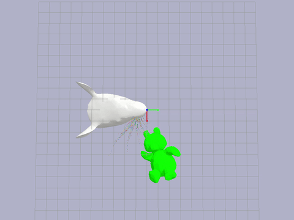
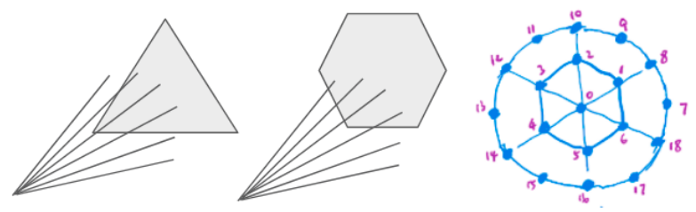
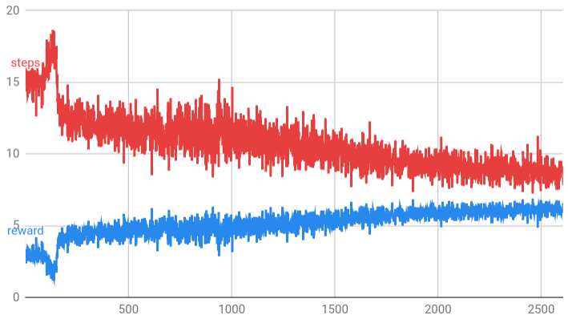

# Deep Q-Learning for Active Sensing

This research project studies how **active sensing**, i.e. choosing what data to collect, can improve data efficiency for **decision making under uncertainty**. Inspired by the active whisking behavior of rats, we use simulated rat whisker sensory signals as a model for **spatial-temporal** data to learn policies that first collect observations and then classify object shapes. We have found

* Spatial frequency in tactile sensing is integral to object classification
* Shaping reward to query information-rich regions accelerates the learning process
* Adding a **recurrent state estimation** structure to the learning pipeline can lead to efficient learning without reward shaping

Fig 1. Simulated whisking against a teddy bear

## Motivation

In a 2017 NeurIPS paper [Toward Goal-Driven Neural Network Models for the Rodent Whisker-Trigeminal System](https://arxiv.org/abs/1706.07555), several deep neural networks of distinct architectures that input whisker array information such as bending and twisting are trained for shape detection.The best top-5 accuracy is 44.8%, while chance is 0.85%. We aim to improve this result on two fronts.
* The current sensory data are obtained from passive sweeping the whisker array against objects, as illustrated in Fig 1. Incorporating active whisking based on past sensory signals reflects how rats behave in real world and can improve the efficiency and accuracy of shape detection. This work is documented below in **subproject I & II**.
* We find the whisker model presented in the paper not biologically realistic. We show that data acquired at a higher sampling frequency with a better whisker model can achieve robust object classification results using just SVM, disputing the need for deep neural networks. This work is documented in **subproject III**.

## Subproject I - Shape Classification using an Abstracted Whisker Model

### Problem Statement

The goal is to learn an optimal controller for a whisker array in space around an object to collect observations in order to sequentially improve the estimation of the object shape in an efficient manner. As a starter, I have simplified the problem to a 2d classification of triangles and hexagons and also the whisker array to a radially outward positioned laser array. The idea is that rats can figure out the distance between contact points and their corresponding whisker base from whisker signals. So we are using Euclidean distances as classification input.

<!--  -->

Fig 2. An abstracted whisker array to simplify data complexity

### Method

We use Deep Q-Learning (Mnih, et al)

<!--  -->

### Results

On average the whisker array is able to move to most differentiating regions and collect observation that gives rise to a 90% confident classification within 10 steps.

<!-- 
 -->

Detailed and updated description of my current results can be found in this [project report](dqn_active_whisking.pdf).

### Active Sensing - Shape Estimation via DQN

One undesirable trait of the above work is reward shaping. Ideally, we would want the dqn agent to discover a policy that chases information rather than implicitly instruct it to do so. This motivates us to have a better representation of the state and by doing so the same algorithm can learn to collect information aggressively without reward shaping in the following shape estimation task.

<!--  -->

By passive sensing, that is randomly querying the environment, an agent will need on average 15 / 36 attempts to estimate the shape accurately, while active choosing what to query allows an average 8 attempts to achieve the same accuracy.

For more information, you can find me at my [portfolio page](https://yanweiw.github.io/).
Cover photo credit to [SeNSE Lab](http://journals.plos.org/ploscompbiol/issue?id=10.1371/issue.pcbi.v07.i04).

<!-- # My battle with SNEAKY bugs!

### Retrained DNN on single observation

Caveat: Overfitting

### Shannon Entropy

Outlier:

# The beautiful demos of learned agents hide all the blood, sweat, and tears that go into creating them.

### 1. The data is too sparse

1. learned that all behavior results in randomness, and this knowledge is burned in
2. reward is not rich, consider multiply by a scaler
3. reduce the dimension of exploration
4. consider teleporting the rat head
5. maybe 3d structure solves the issue

### 2. The reward is flawed

1. Currently I am using binary cross-entropy loss as negative reward
2. maybe try only one reward at the terminal state

### 3. Inexact representation of state

1. I am using the hidden state vector of LSTM layer to approximate state
2. Maybe use some more direct state representation such as consecutive observations

### 4. Neural network not deep enough / hyperparameters

1. Current network trains for 20 min. Should I start looking at GPU?
2. exploration decay parameter

<!--  -->
