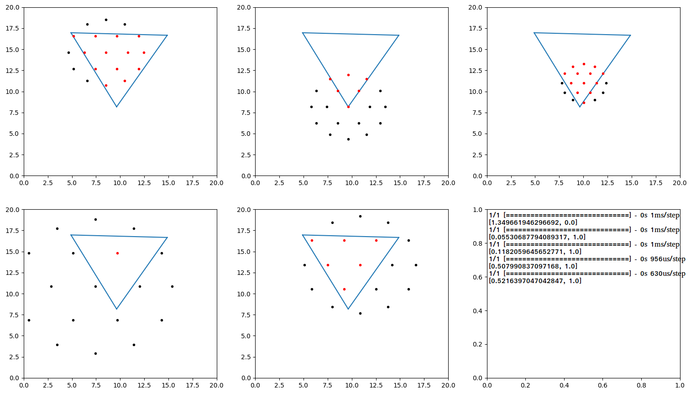
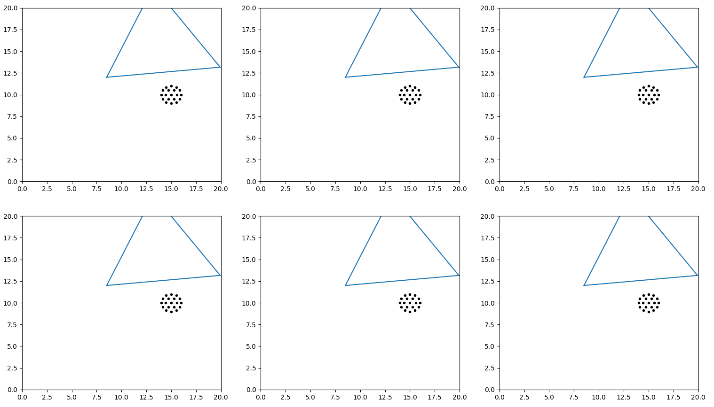

# Deep Q-Learning for Active Sensing

This research project studies how **active sensing**, i.e. choosing what data to collect, can improve data efficiency for **decision making under uncertainty**. Inspired by the active whisking behavior of rats, we use simulated rat whisker sensory signals as a model for **spatial-temporal** data to learn policies that first collect observations and then classify object shapes. We have found

* Spatial frequency in tactile sensing is integral to object shape classification
* Shaping reward to query information-rich regions accelerates the learning process
* Adding a **recurrent state estimation** structure can lead to efficient learning without reward shaping

Fig 1. Simulated whisking against a teddy bear

## Motivation

In a 2017 NeurIPS paper [Toward Goal-Driven Neural Network Models for the Rodent Whisker-Trigeminal System](https://arxiv.org/abs/1706.07555), several deep neural networks of distinct architectures that input whisker array information such as bending and twisting are trained for shape detection.The best top-5 accuracy is 44.8%, while chance is 0.85%. We aim to improve this result on two fronts.
* The current sensory data are obtained from passive sweeping the whisker array against objects, as illustrated in Fig 1. Incorporating active whisking based on past sensory signals reflects how rats behave in real world and can improve the efficiency and accuracy of shape detection. This work is documented below in **subproject I & II**.
* We find the whisker model presented in the paper not biologically realistic. We show that data acquired at a higher sampling frequency with a better whisker model can achieve robust object shape classification results using just SVM, disputing the need for deep neural networks. This work is documented in **subproject III**.

## Subproject I - Shape Classification with an Abstracted Whisker Model

### Problem Statement

The goal is to learn an optimal controller for a whisker array in space around an object to collect observations in order to sequentially improve the estimation of the object shape in an efficient manner. As a starter, I have simplified the problem to a 2d classification of triangles and hexagons and also the whisker array to a radially outward positioned laser array. The idea is that rats can figure out the distance between contact points and their corresponding whisker base from whisker signals. So we are using Euclidean distances as classification input.

<!--  -->

Fig 2. An abstracted whisker array to simplify data complexity

### Method

We use a [Deep Q-Network (Mnih, et al)](https://www.cs.toronto.edu/~vmnih/docs/dqn.pdf) to learn the active placement of a sparse sensor, characterized by only 19 distance measurements. We initialize a perception network that can predict the correct classification given salient observations distinct to each object. We test on a CNN and RNN and we find CNN gives better training signals than RNN to DQN. We posit that the vanilla RNN struggles to internally synthesize an accurate state representation recurrently. We test the importance of learning a good representation in subproject II. A detailed illustration of the algorithm is listed in Fig 3.

<!--  -->

Fig 3. Customized DQN algorithm, where DQN represents a policy learner, RNN a perception network, and Bullet a simulation engine

### Results & Contributions

Initially, we make reward 10 if the perception network can output a correct prediction and -1 otherwise to account for time and energy cost. This naive approach fails due to:
* the reward is too sparse and consequently the agent learns to stay put as most attempts beget a negative reward
* without an explicit structure, the perception network fails to learn implicitly a good representation of the state.

We test the second hypothesis in subproject II and the first hypothesis here by shaping the reward to include **a entropy term that characterizes the information richness of an observation**. This change smooths out the reward terrain and focuses the exploration on high-curvature regions such as edges. Consequently, the DQN learns a strategy to move towards edges and corners to collect observations, and on average the agent is able to predict shapes with a 90% confidence within 10 steps, compared to a 15-step average by random passive sampling.

<!-- 
 -->

Fig 4. Two trajectories of active sensor placement. Red dots indicate contact points on shape and return distance measurements while black dots indicate "off shape" and return infinity. Since the 19 distance sensors are radially outward positioned, dots converge as the sensor moves near an object.  

Detailed description can be found in this [project report](dqn_active_whisking.pdf).

## Subproject II - Shape Estimation via Active Sensing

### Contributions

Despite efficient classification with partial observations in subproject I, we acknowledge the lack of generality due to reward shaping with physics priors. We want to learn a policy without any heuristics such as [information-based exploration principles](https://github.com/yanweiw/infotaxis). We attempt the same active sensing problem with a shape estimation task on a grid world. There has been [model-based work in this domain using ergodicity (Abraham, et al)](https://arxiv.org/pdf/1709.01560.pdf) and our work differs in that such strategy is purely learned from data without explicit analytical models. We show that **building recurrent structures to enforce the agent to learn an accurate state representation eases learning and reduces the need for reward shaping.**

<!--  -->

Fig 5. Learned active sensing sequence

### Problem Statement & Method

Given an image corrupted by noises, we want to sequentially uncover a patch (in total 6 x 6 patches) to obtain a partial observation of the ground truth in order to estimate the shape in the image. We improve upon the DQN method in subproject I by eliciting the learning of state representation and subsequently training decision-making upon explicit state representations. By enforcing such a structure the same algorithm can learn to collect information aggressively without reward shaping.

Specifically, we first train a [U-net (Ronneberger, et al)](https://arxiv.org/abs/1505.04597) like perception network to fully convolutionally predict dense representation of partially uncovered noisy images. In Fig 6, we show state representations after randomly uncovering 1 - 18 patches. On average, the trained perception network can estimate with 95% accuracy after 15 **random** partial observations.

Fig 6. Shape estimations after random queries

After training the perception network, we seek to directly optimize the query sequence upon these explicit state representations, which can be interpreted as belief states from a POMDP perspective. Rewards are directly linked to binary entropy loss between the belief and the ground truth and thus naturally less sparse. Fig 6. also shows a positive correlation between the number of observations and the accuracy of beliefs.

### Results

We train the DQN to recurrently update the belief in however manner it finds most efficient without reward shaping. Training converges after 1.3 million epochs and the average number of queries drops from 15 random ones to 8 active ones as shown in Fig 7. Our work shows active sensing outperforms passive random sensing by around 7 out of total 36 attempts (8 vs 15) in terms of data efficiency while achieving the same accuracy on this shape estimation task.  

Fig 7. Average rewards and steps evolution. Each unit of x axis is 50 epochs.

## Subproject III - Investigating Complexity of Spatial-temporal Tactile Data

### Contributions

In this subproject we investigate data complexity of the passive sweeping dataset used in the aforementioned [2017 NeurIPS paper](https://arxiv.org/abs/1706.07555) and generated by means shown in Fig 1. The paper claims in the validation experiment, binary linear SVM is not sufficient to separate ducks from bears in the presence of scale, speed, position, and orientation variation, thus calling for the use of deep neural networks, indicating the need for rat cortex in classification tasks from a neuroscience perspective. We believe higher perception structure such as cortex is not necessary in this process and dispute the paper's claim by showing a better whisker model sampling at a higher frequency can lead to linearly separable dataset that precludes the need for DNN.

### Bear vs Duck Binary SVM Classification

We generate and process the data as outlined in the paper using our new whisker model and sampling frequency at 200 Hz rather than the 100 Hz in the paper. We perform binary SVM classimaiton on a Bear and Duck passive sweeping dataset with variations in scale, speed, position, and orientation. We show results in Fig 8. that accuracy decreases significantly as we down-samples the dataset in the temporal domain, which verifies the importance of spatial frequency in classification tasks.

|||
|-----------------------------------------------------|----------------------------------------------------|
|Downsampled to 250 timesteps, top accuracy: 86%      |Downsampled to 100 timesteps, top accuracy: 73%     |

Fig 8. Binary classification results vs feature vector lengths. Red dots represent accuracy and blue curve represents standard deviation. Accuracy improves as we include more features during the SVM fitting

### 10-Way Multi-class SVM Classification

We further test our assumption that one can infer from raw spatial-temporal data from tactile sensors the shape of an object without complex non-linear processing by attempting SVM classification on 10 objects of distinct topology. We report the accuracy results and confusion matrix in Fig 9. As we are able to achieve 56% accuracy, significantly outperforming a chance accuracy of 10%, we conclude neither DNN nor the biological parallel cortex is warranted in this object shape classification task.

|||
|-----------------------------------------------------|-----------------------------------------------------|
|timesteps: 300, and top accuracy: 56%|confusion matrix|

For more information, you can find me at my [portfolio page](https://yanweiw.github.io/).
Cover photo credit to [SeNSE Lab](http://journals.plos.org/ploscompbiol/issue?id=10.1371/issue.pcbi.v07.i04).

<!-- # My battle with SNEAKY bugs!

### Retrained DNN on single observation

Caveat: Overfitting

### Shannon Entropy

Outlier:

# The beautiful demos of learned agents hide all the blood, sweat, and tears that go into creating them.

### 1. The data is too sparse

1. learned that all behavior results in randomness, and this knowledge is burned in
2. reward is not rich, consider multiply by a scaler
3. reduce the dimension of exploration
4. consider teleporting the rat head
5. maybe 3d structure solves the issue

### 2. The reward is flawed

1. Currently I am using binary cross-entropy loss as negative reward
2. maybe try only one reward at the terminal state

### 3. Inexact representation of state

1. I am using the hidden state vector of LSTM layer to approximate state
2. Maybe use some more direct state representation such as consecutive observations

### 4. Neural network not deep enough / hyperparameters

1. Current network trains for 20 min. Should I start looking at GPU?
2. exploration decay parameter

<!--  -->
