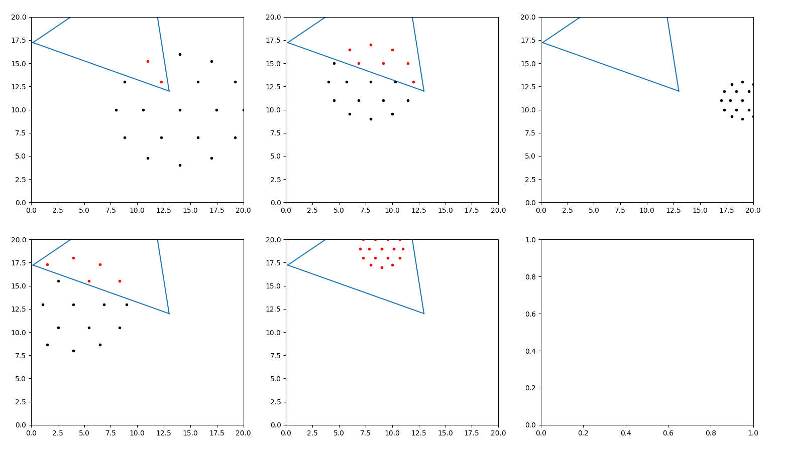

# The beautiful demos of learned agents hide all the blood, sweat, and tears that go into creating them.

### 1. The data is too sparse

1. learned that all behavior results in randomness, and this knowledge is burned in
2. reward is not rich, consider multiply by a scaler
3. reduce the dimension of exploration
4. consider teleporting the rat head
5. maybe 3d structure solves the issue

### 2. The reward is flawed

1. Currently I am using binary cross-entropy loss as negative reward
2. maybe try only one reward at the terminal state

### 3. Inexact representation of state

1. I am using the hidden state vector of LSTM layer to approximate state
2. Maybe use some more direct state representation such as consecutive observations

### 4. Neural network not deep enough / hyperparameters

1. Current network trains for 20 min. Should I start looking at GPU?
2. exploration decay parameter

<!--  -->
