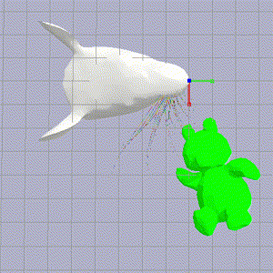
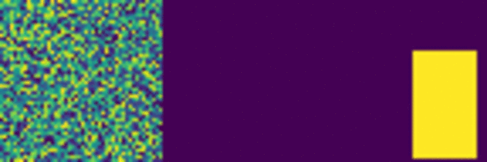

# DQN for active whisking

In a 2017 NIPS paper [Toward Goal-Driven Neural Network Models for the Rodent Whisker-Trigeminal System](https://arxiv.org/abs/1706.07555), several deep neural networks that input whisker array information such as bending and twisting are trained for shape detection.The best top-5 accuracy is 44.8%, while chance is 0.85%. One potential improvement on this performance is active sensing, as the current sensing data are obtained from passive sweeping the whisker array against objects. Incorporating active whiskering based on past sensing signals reflects how rats behave in real world and can potentially improve the efficiency and accuracy of shape detection.

### Model Abstraction

The goal is to learn an optimal controller for a whisker array in space around an object to collect observations in order to sequentially improve the estimation of the object shape in an efficient manner. As a starter, I have simplified the problem to a 2d classification of triangles and hexagons and also the whisker array to a radially outward positioned laser array. The idea is that rats can figure out the distance between contact points and their corresponding whisker base from whisker signals. So we are using Euclidean distances as classification input.

### DQN Algorithm

### Results

On average the whisker array is able to move to most differentiating regions and collect observation that gives rise to a 90% confident classification within 10 steps.

Detailed and updated description of my current results can be found in this [project report](dqn_active_whisking.pdf).

### Active Sensing - Shape Estimation via DQN

One undesirable trait of the above work is reward shaping. Ideally, we would want the dqn agent to discover a policy that chases information rather than implicitly instruct it to do so. This motivates us to have a better representation of the state and by doing so the same algorithm can learn to collect information aggressively without reward shaping in the following shape estimation task.

<!--  -->

By passive sensing, that is randomly querying the environment, an agent will need on average 15 / 36 attempts to estimate the shape accurately, while active choosing what to query allows an average 8 attempts to achieve the same accuracy.

For more information, you can find me at my [portfolio page](https://yanweiw.github.io/).
Cover photo credit to [SeNSE Lab](http://journals.plos.org/ploscompbiol/issue?id=10.1371/issue.pcbi.v07.i04).

<!-- # My battle with SNEAKY bugs!

### Retrained DNN on single observation

Caveat: Overfitting

### Shannon Entropy

Outlier:

# The beautiful demos of learned agents hide all the blood, sweat, and tears that go into creating them.

### 1. The data is too sparse

1. learned that all behavior results in randomness, and this knowledge is burned in
2. reward is not rich, consider multiply by a scaler
3. reduce the dimension of exploration
4. consider teleporting the rat head
5. maybe 3d structure solves the issue

### 2. The reward is flawed

1. Currently I am using binary cross-entropy loss as negative reward
2. maybe try only one reward at the terminal state

### 3. Inexact representation of state

1. I am using the hidden state vector of LSTM layer to approximate state
2. Maybe use some more direct state representation such as consecutive observations

### 4. Neural network not deep enough / hyperparameters

1. Current network trains for 20 min. Should I start looking at GPU?
2. exploration decay parameter

<!--  -->
